# Creating a Load Balancer Lab with Nginx and Multiple Vagrant Servers

## Objective

To create a load balancer lab using Nginx, three web servers, and one Nginx server. The web servers should host informative HTML webpages

### Prerequisites

Install VirtualBox: Download and install VirtualBox from VirtualBox's official website [virtualBox's Official website](https://www.virtualbox.org/)

Install Vagrant: Download and install Vagrant from the Vagrant website [Vagrant website](https://developer.hashicorp.com/vagrant)

### **Steps**

### **Step 1: Prepare the Lab Directory**

### **Create a new directory for your project and navigate to it in your terminal. This directory will contain the Vagrant configuration files**

#### I did the below commands to create a new directory and navigate inside the directory

~~~bash
mkdir load_balancer_lab
cd load_balancer_lab
~~~

### **Step 2: Set Up Vagrant Configuration: Create a Vagrantfile to define your virtual machines and their configurations**

### Aftter navigating into my load_balancer_lab directory, I did the below commands to create a vagrantfile in my directory and to define my virtual machines and their configurations in it

~~~bash
vagrant init
~~~

### **Step 3: Create Provisioning Scripts**

### **Create provisioning scripts for Nginx and the web servers**

- **For Nginx : Create provision/nginx.sh**

    ~~~bash
    #!/bin/bash
    apt-get update
    apt-get install -y nginx
    ~~~

- **For Webserver : Create provision/webserver.sh**

    ~~~bash
    #!/bin/bash
    apt-get update
    apt-get install -y nginx

    # Check the hostname and set content accordingly
    if [[ $(hostname) == "web1" ]]; then
        echo "This is Web Server 1" > /var/www/html/index.html

    elif [[ $(hostname) == "web2" ]]; then
        echo "This is Web Server 2" > /var/www/html/index.html

    elif [[ $(hostname) == "web3" ]]; then
        echo "This is Web Server 3" > /var/www/html/index.html
    else
        echo "This is a default page" > /var/www/html/index.html
    fi

    ~~~

- **I created a folder for provisioning scripts and name it provision**

    

- **I created a script file: nginx.sh and define the scripts in it**

    

- **I created a script file: webserver.sh and define the scripts in it**

### **Step 4: Initialize and Start Vagrant Machines**

### **Navigate to your project directory and run the following command**

~~~bash
vagrant up
~~~

### I navigate to my directory and run the below command to start up my machine with the defined configuration and scripts

~~~bash
vagrant up
~~~

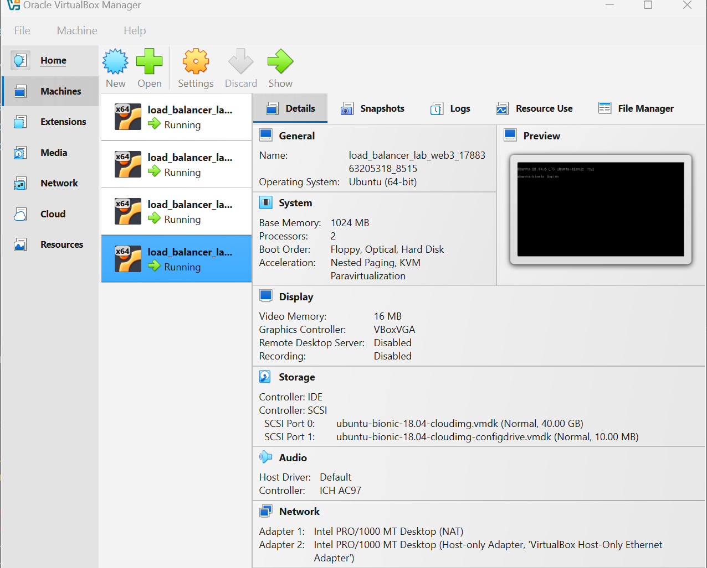

### **Step 5: Configure Nginx Load Balancer**

- **SSH into the Nginx virtual machine**

    ~~~bash
    vagrant ssh nginx
    ~~~

    **I did vagrant ssh nginx to go into the vagrant machine**

    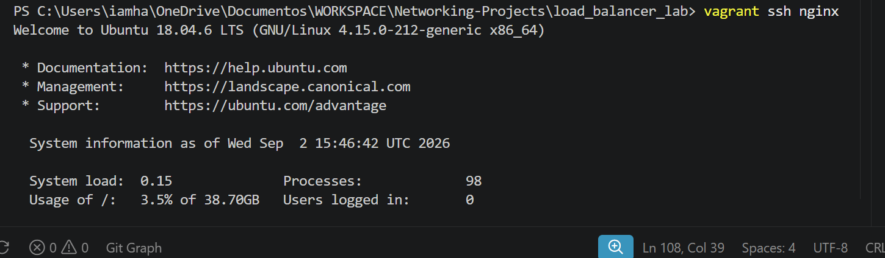

    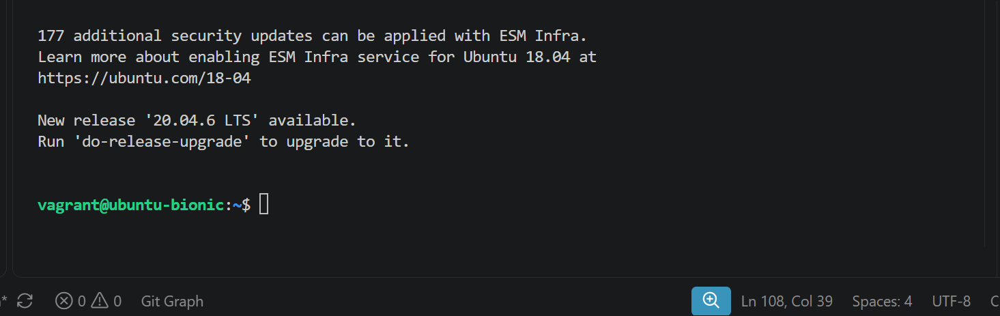

- **Edit the Nginx configuration file to set up load balancing:**

    I did the below commands to edit the existing file

    ~~~bash
    sudo nano /etc/nginx/sites-available/default
    ~~~

    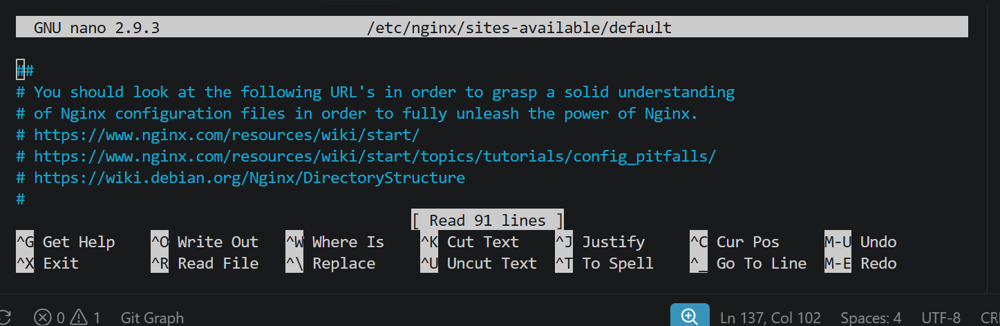

- **Edit the file to include the following configuration inside the server block:**

    I added the below configuration to my nginx file

        location / {
          proxy_pass http://web_servers;
        }
        upstream web_servers {
            server <web1_ip>:80;
            server <web2_ip>:80;
            server <web3_ip>:80;
        }

    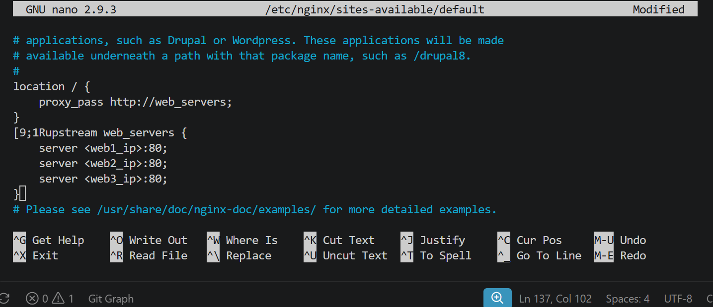

- **Replace <web1_ip>, <web2_ip>, and <web3_ip> with the actual private IPs of your web server VMs.**

    To get each webserver ip address, i did the following below commands;

    ~~~bash
    vagrant ssh web1

    ip addr or hostname -I
    ~~~

    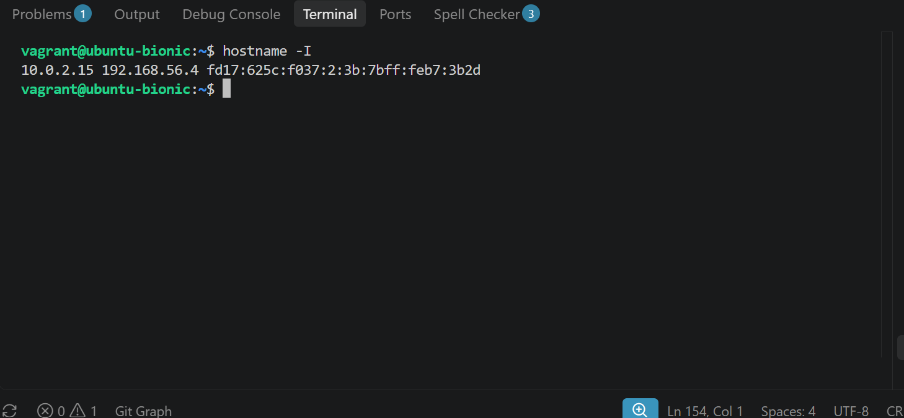

    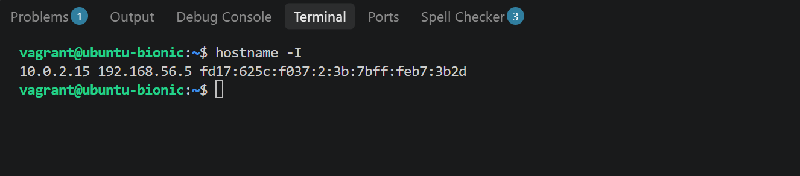

    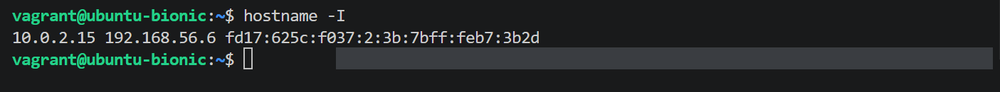

    After getting the ip addresses for the three webserver, i replaced the ip address in the nginx configuration to the actual ip address.

    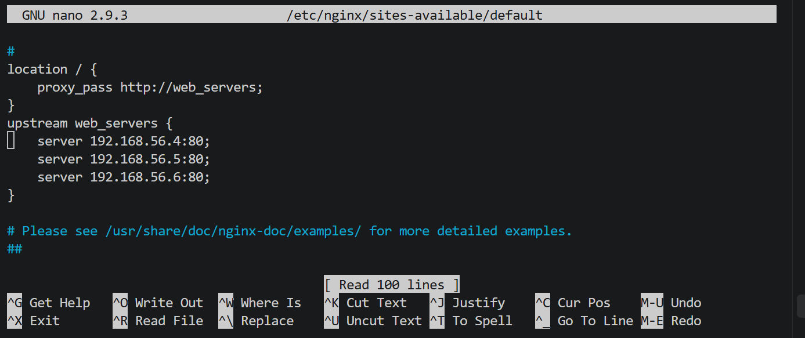

### **Step 6: Test the Load Balancer**

- **Open a web browser on your local machine and navigate to the private IP address of your Nginx VM**

- **You should see the load-balanced web servers serving informative HTML pages in a round-robin manner**

    **I tested my private Ip address of my nginx vms on my firefox browser**

    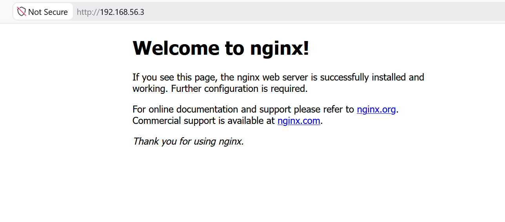

### **Step 7: Verify Load Balancing**

- **To verify that load balancing is working, SSH into each web server and check their access logs:**

    ~~~bash
    vagrant ssh web1
    tail -f /var/log/nginx/access.log

    vagrant ssh web2
    tail -f /var/log/nginx/access.log

    vagrant ssh web3
    tail -f /var/log/nginx/access.log
    ~~~

    **I did the above commands;**

    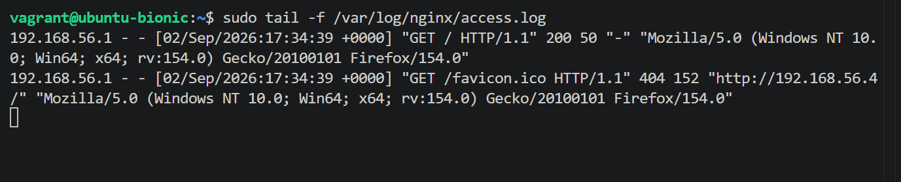

    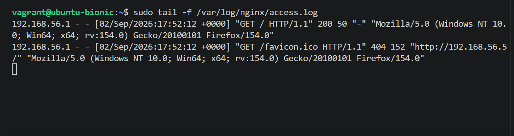

    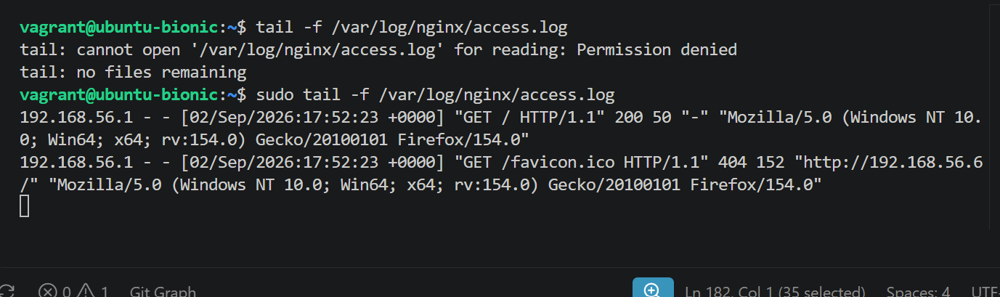

### **Step 8: Check Load Balancing in a Web Browser**

- **On your local machine (not within the virtual machines), open a web browser.**
- **In the browser's address bar, type the private IP address of your Nginx virtual machine.**
- **Press Enter.**
- **You should observe the load-balanced web servers in action, confirming that Nginx is successfully load-balancing the requests.**

    **I copied my private ip address of nginx to my firefox browser, each refresh changes the webserver which confirmed my load balancers is working**

    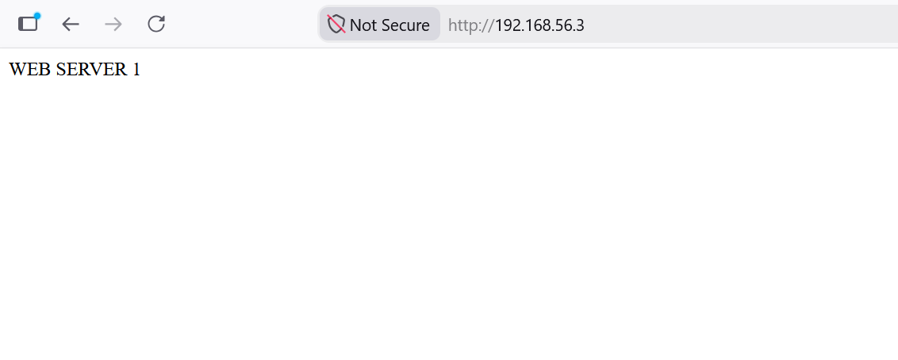

    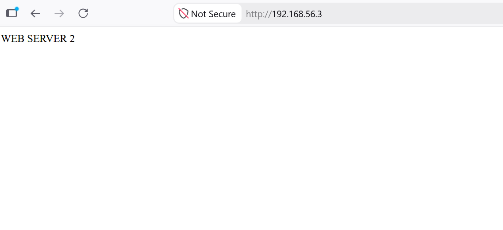

    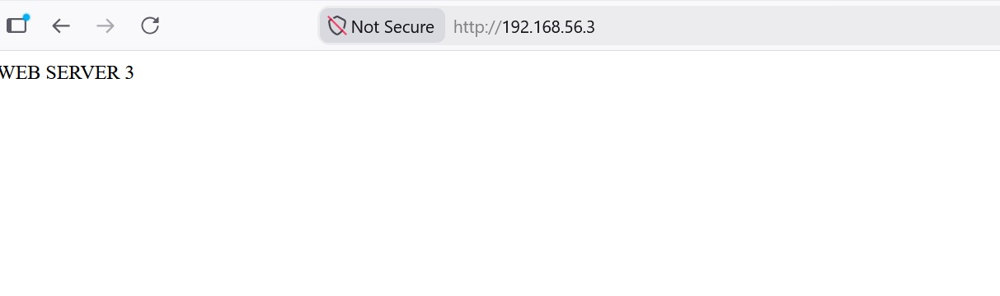
