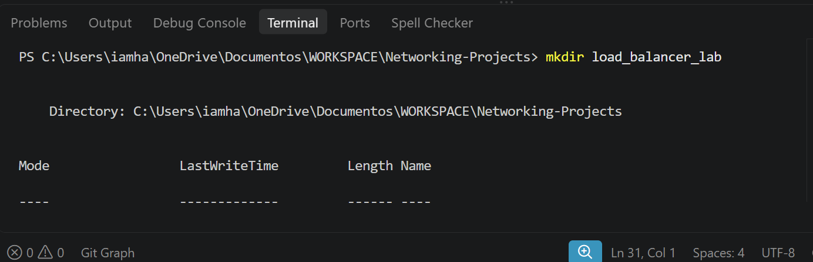
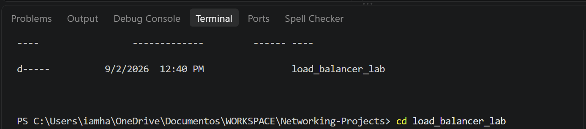
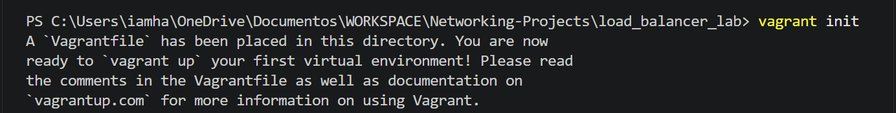
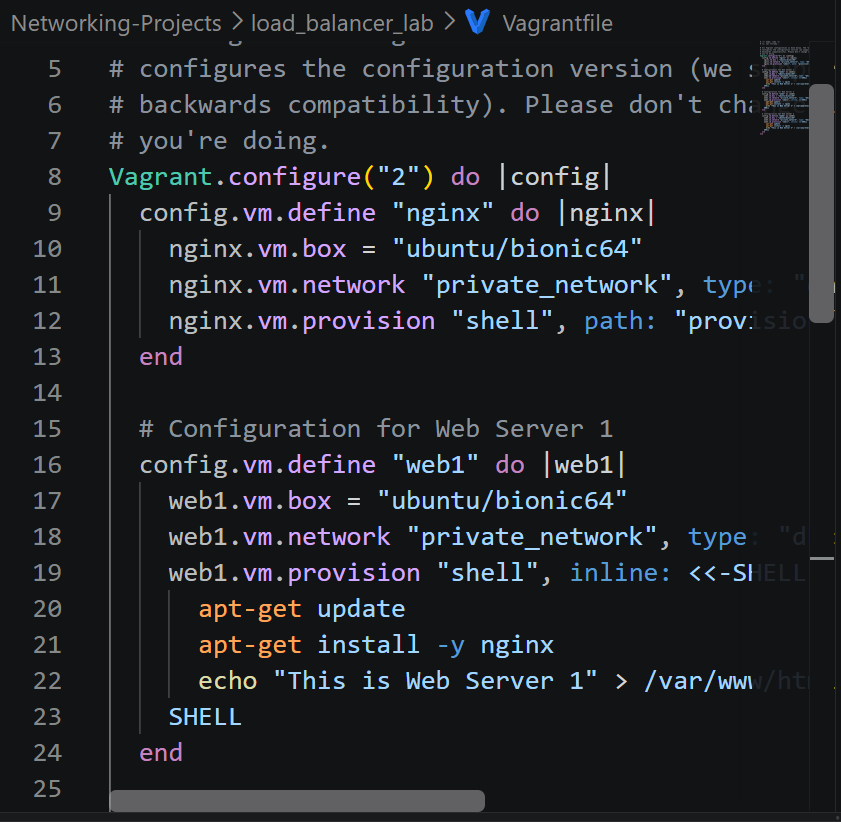
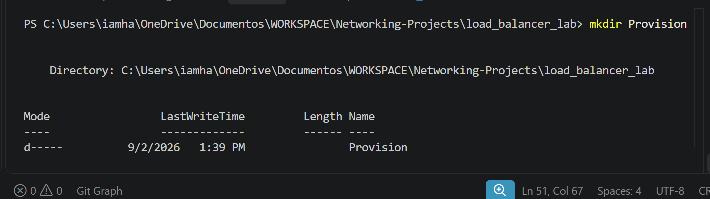
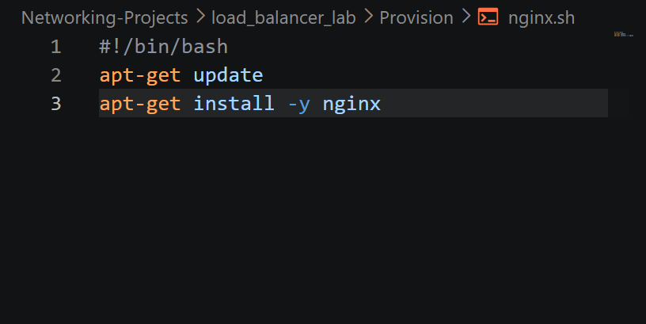
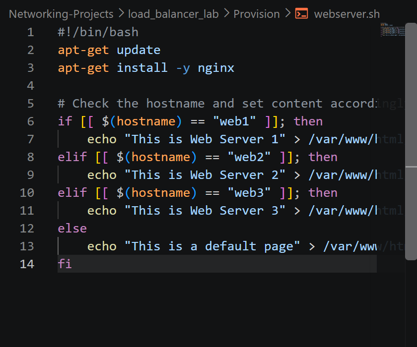

# Creating a Load Balancer Lab with Nginx and Multiple Vagrant Servers

## Objective

To create a load balancer lab using Nginx, three web servers, and one Nginx server. The web servers should host informative HTML webpages

### Prerequisites

Install VirtualBox: Download and install VirtualBox from VirtualBox's official website [virtualBox's Official website](https://www.virtualbox.org/)

Install Vagrant: Download and install Vagrant from the Vagrant website [Vagrant website](https://developer.hashicorp.com/vagrant)

### **Steps**

### **Step 1: Prepare the Lab Directory**

### **Create a new directory for your project and navigate to it in your terminal. This directory will contain the Vagrant configuration files**

#### I did the below commands to create a new directory and navigate inside the directory

~~~bash
mkdir load_balancer_lab
cd load_balancer_lab
~~~

### **Step 2: Set Up Vagrant Configuration: Create a Vagrantfile to define your virtual machines and their configurations**

### Aftter navigating into my load_balancer_lab directory, I did the below commands to create a vagrantfile in my directory and to define my virtual machines and their configurations in it

~~~bash
vagrant init
~~~

### **Step 3: Create Provisioning Scripts**

### **Create provisioning scripts for Nginx and the web servers**

- **For Nginx : Create provision/nginx.sh**

    ~~~bash
    #!/bin/bash
    apt-get update
    apt-get install -y nginx
    ~~~

- **For Webserver : Create provision/webserver.sh**

    ~~~bash
    #!/bin/bash
    apt-get update
    apt-get install -y nginx

    # Check the hostname and set content accordingly
    if [[ $(hostname) == "web1" ]]; then
        echo "This is Web Server 1" > /var/www/html/index.html

    elif [[ $(hostname) == "web2" ]]; then
        echo "This is Web Server 2" > /var/www/html/index.html

    elif [[ $(hostname) == "web3" ]]; then
        echo "This is Web Server 3" > /var/www/html/index.html
    else
        echo "This is a default page" > /var/www/html/index.html
    fi

    ~~~

- **I created a folder for provisioning scripts and name it provision**

    

- **I created a script file: nginx.sh and define the scripts in it**

    

- **I created a script file: webserver.sh and define the scripts in it**

### **Step 4: Initialize and Start Vagrant Machines**

### **Navigate to your project directory and run the following command**

~~~bash
vagrant up
~~~

### I navigate to my directory and run the below command to start up my machine with the defined configuration and scripts

~~~bash
vagrant up
~~~
